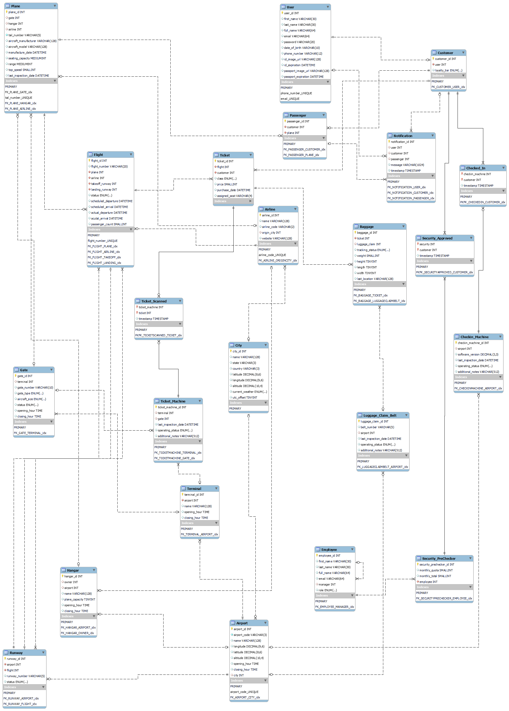

# Airport Management System Database

| Milestone | Date Submitted |
|-----------|----------------|
| 3         | 10/16/2024     |
| 2         | 10/2/2024      |
| 1         | 09/18/2024     |

## Table of Contents
1. [Project Description](#1-project-description)
2. [Use Cases](#2-use-cases)
3. [Functional Database Requirements](#3-functional-database-requirements)
4. [Non-Functional Database Requirements](#4-non-functional-database-requirements)
5. [Entity Relationship Diagram (ERD)](#5-entity-relationship-diagram-erd)
6. [Entity Set Description](#6-entity-set-description)
7. [Enhanced Entity-Relationship Diagram (EER)](#7-enhanced-entity-relationship-diagram-eer)
8. [Normalization Techniques Used](#8-normalization-techniques-used)

## 1. Project Description

I plan to make an Airport Management System Database that will transform the way people interact with air travel. I want to work on this project because over the past couple of years I have been flying more often, about 2 times per year. This has given me the insight and motivation to try and make improvements to some of the problems in the system for users.

The graph below is a visual representation of the problem I am aiming to solve. In the graph, we are comparing the distance in miles compared to time in hours it takes for three modes of transportation to go. The time starts from when you leave your house. As we see, cars start out the fastest but are overtaken by trains within an hour of travel. However, it takes nearly four hours for airplanes to overtake cars, despite how planes move over eight times as fast as cars. This is due to the fact that you have to travel far to even reach an airport, and it can take several hours to get your ticket and get through security to board the plane.

To solve this problem, I will design the system to minimize the time it takes for users from leaving their house to boarding the plane. While the system cannot start as quickly as cars (since users do not live at the airport), it can be made closer to that of trains, which are faster due to little to no security checks at stations. In the U.S., TSA PreCheck allows precheck holders to skip the security check, and my system will make this standard for all users. Additionally, I will implement automated check-in machines for both domestic and international flights.

Comparing my system to Delta Airlines: First, you must purchase your ticket more than a month ahead. When you arrive at the airport, you wait about 30 minutes to check in at a desk and drop off your baggage. Finally, you wait over an hour to get through security. This results in nearly two hours spent at the airport without even boarding. My system will feature automated check-in and baggage drop-off, and every passenger will be pre-checked for security, saving the user two hours.

Next, I will look at the Japanese Shinkansen High-Speed Rail System for inspiration. Tickets can be pre-purchased but also bought up to 15 minutes before departure. Passengers use their ticket to get through the gate and walk directly to the platform, with no waiting lines—designed to get you to your destination as quickly as possible.

## 2. Use Cases

**Use Case 1: John**  
John wants to visit his family across the country. After registering an account at his nearest airport, he purchases a ticket and checks in one bag at the self-help machine. He puts his ticket into the ticket machine at the terminal and walks through to his gate with time to spare. He enjoys some last-minute shopping before boarding. The process is so fast that John feels relaxed and happy.

**Use Case 2: Sarah**  
Sarah needs to travel for an important business meeting in another city. She registers for an account with the Airport Management System and purchases her ticket online, selecting a flight that departs in two hours. After receiving check-in instructions and a QR code, she arrives at the airport and heads straight to the automated check-in machines, checking in her bag and receiving her boarding pass in under five minutes. She walks through the terminal with ease, feeling some relief despite the stress of the meeting.

**Use Case 3: Mike**  
Mike plans a family vacation to visit relatives. He uses the Airport Management System to book tickets for himself, his spouse, and their two kids. On the travel day, they arrive just an hour before departure. Mike uses the automated check-in kiosks to print boarding passes for the family and check their luggage. After a quick stroll to their gate, they board the plane, ready for a stress-free vacation.

## 3. Functional Database Requirements

- **Airport**
  - Located inside at most one City.
  - Has many Terminals, Hangars, Runways, Luggage Claim Belts, and Check-in Machines.
  - Has a unique Airport Code.

- **City**
  - Has many Airports.
  - Has a name and geographic coordinates.

- **Terminal**
  - Belongs to one and only one Airport.
  - Must have at least one Gate and Ticket Machine.

- **Gate**
  - Belongs to at most one Terminal.
  - Can have at most one Plane docked and many Ticket Machines.

- **Plane**
  - Docked at at most one Gate.
  - Owned by at most one Airline.
  - Boarded by many Passengers and associated with many Flights.
  - Can be docked at at most one Hangar.

- **Hangar**
  - Docks many Planes and is owned by at most one Airline.
  - Located at zero or one Airport.

- **Airline**
  - Owns many Planes and Hangars.
  - Operates many Flights.

- **Flight**
  - Associated with one Plane and operated by one Airline.
  - Takes off and lands at one Runway each.
  - Issues at least one Ticket.

- **Runway**
  - Belongs to one Airport and is designated for take-off or landing for a specific flight.
  - Has a unique Runway Identifier.

- **User**
  - Receives many Notifications.
  - Has a unique User ID, name, and email address.

- **Customer**
  - Is a User who has purchased a Ticket.
  - Owns at least one Ticket and must check-in at least one Check-in Machine.

- **Passenger**
  - Is a Customer who has passed security pre-check and checked-in.
  - Can board at most one Plane.

- **Baggage**
  - Tied to one Ticket and sent to at most one Luggage Claim Belt.
  - Has a status (checked-in, on_plane, at_claim) and a unique Baggage ID.

- **Ticket**
  - Owned by at most one Customer and associated with one Flight.
  - Associated with zero or many Bags and has a Type (Economy, Business, First Class).

- **Check-in Machine**
  - Belongs to at most one Airport and checks in many Customers.

- **Ticket Machine**
  - Scans many Tickets and is owned by at most one Gate and one Terminal.

- **Luggage Claim Belt**
  - Has many Bags and belongs to at most one Airport.

- **Employee**
  - Has a unique Employee ID, role, name, and can manage other Employees.

- **Security Pre-Checker**
  - Is an Employee who can approve or disapprove Customers.

- **Notification**
  - Sent to at most one Customer, Passenger, and User, with a unique Notification ID and message.

## 4. Non-functional Database Requirements

- **Performance**
  - Query results must return within 100 milliseconds.
  - Latency between database and application should not exceed 30 milliseconds.
  - Must support concurrent transactions.

- **Security**
  - Only encrypted passwords are supported.
  - Measures to protect against SQL injection attacks must be included.
  - Automatic daily backups at 11:59 PM.

- **Scalability**
  - Must support horizontal scaling without downtime and allow for easy vertical scaling.
  - Load balancing must distribute database traffic evenly.

- **Capability**
  - Only supports a relational data model with automated backup and recovery options.
  - Must support easy data migration tools.

- **Environmental**
  - Must be energy efficient with efficient cooling systems.
  - Must comply with relevant regulations.

- **Coding Standard**
  - Naming conventions must follow standard practices, and all code must be documented.
  - Changes must be tracked using version control.

- **Storage**
  - Must support growth to at least 10 TB without performance issues.
  - Data must be stored redundantly for hardware failure protection and optimized using compression techniques.

- **Privacy**
  - User consent must be obtained before collecting personal data.
  - Only necessary personal data should be collected.
  - Must notify affected users of data breaches within 10 days.

## 5. Entity Relationship Diagram (ERD)

## 6. Entity Set Description

### Airport (Strong)
- **airport_id**: numeric, primary key
- **airport_code**: alphanumeric, unique key
- **name**: alphanumeric
- **city**: numeric, foreign key (references City entity set)
- **longitude**: numeric
- **latitude**: numeric
- **altitude**: numeric
- **operating_hours**: numeric

### City (Strong)
- **city_id**: primary key, numeric
- **name**: alphanumeric
- **state**: alphanumeric
- **country**: alphanumeric
- **longitude**: numeric
- **latitude**: numeric
- **altitude**: numeric
- **utc_offset**: numeric
- **current_weather**: enum

### Terminal (Weak)
- **terminal_id**: numeric, primary key
- **airport**: numeric, foreign key (references Airport entity set)
- **name**: alphanumeric
- **operating_hours**: numeric

### Gate (Strong)
- **gate_id**: numeric, primary key
- **terminal**: numeric, foreign key (references Terminal entity set)
- **gate_number**: alphanumeric
- **gate_type**: enum
- **aircraft_size**: enum
- **status**: enum
- **operating_hours**: numeric

### Plane (Strong)
- **plane_id**: numeric, primary key
- **gate**: numeric, foreign key (references Gate entity set)
- **hangar**: numeric, foreign key (references Hangar entity set)
- **airline**: numeric, foreign key (references Airline entity set)
- **tail_number**: numeric, unique key
- **aircraft_manufacturer**: alphanumeric
- **aircraft_model**: alphanumeric
- **manufacture_date**: numeric
- **seating_capacity**: numeric
- **range**: numeric
- **top_speed**: numeric
- **last_inspection_date**: numeric

### Hangar (Strong)
- **hangar_id**: numeric, primary key
- **owner**: numeric, foreign key (references Airline entity set)
- **airport**: numeric, foreign key (references Airport entity set)
- **name**: alphanumeric
- **plane_capacity**: numeric
- **operating_hours**: numeric

### Airline (Strong)
- **airline_id**: numeric, primary key
- **name**: alphanumeric
- **airline_code**: alphanumeric, unique key
- **origin_city**: numeric, foreign key (references City entity set)
- **website**: alphanumeric

### Flight (Weak)
- **flight_id**: numeric, primary key
- **flight_number**: alphanumeric, unique key
- **plane**: numeric, foreign key (references Plane entity set)
- **airline**: numeric, foreign key (references Airline entity set)
- **takeoff_runway**: numeric, foreign key (references Runway entity set)
- **landing_runway**: numeric, foreign key (references Runway entity set)
- **status**: enum
- **scheduled_departure**: numeric
- **scheduled_arrival**: numeric
- **actual_departure**: numeric
- **actual_arrival**: numeric
- **passenger_count**: numeric

### Runway (Weak)
- **runway_id**: numeric, primary key
- **airport**: numeric, foreign key (references Airport entity set)
- **flight**: numeric, foreign key (references Flight entity set)
- **runway_number**: alphanumeric
- **status**: enum

### User (Strong)
- **user_id**: numeric, primary key
- **first_name**: alphanumeric
- **last_name**: alphanumeric
- **full_name**: alphanumeric, auto generated
- **email**: alphanumeric, unique key
- **password**: alphanumeric
- **date_of_birth**: alphanumeric
- **phone_number**: alphanumeric, unique key
- **id_image_url**: alphanumeric
- **id_expiration**: numeric
- **passport_image_url**: alphanumeric
- **passport_expiration**: numeric

### Customer (Weak)
- **customer_id**: numeric, primary key
- **user**: numeric, foreign key (references User entity set)
- **loyalty_tier**: enum

### Passenger (Weak)
- **passenger_id**: numeric, primary key
- **customer**: numeric, foreign key (references Customer entity set)
- **plane**: numeric, foreign key (references Plane entity set)

### Baggage (Weak)
- **baggage_id**: numeric, primary key
- **ticket**: numeric, foreign key (references Ticket entity set)
- **luggage_claim**: numeric, foreign key (references Luggage Claim Belt entity set)
- **tracking_status**: enum
- **weight**: numeric
- **height**: numeric
- **length**: numeric
- **width**: numeric
- **last_location**: alphanumeric

### Ticket (Weak)
- **ticket_id**: numeric, primary key
- **flight**: numeric, foreign key (references Flight entity set)
- **customer**: numeric, foreign key (references Customer entity set)
- **class**: enum
- **price**: numeric
- **purchase_date**: numeric
- **assigned_seat**: alphanumeric

### Check-in Machine (Strong)
- **checkin_machine_id**: numeric, primary key
- **airport**: numeric, foreign key (references Airport entity set)
- **software_version**: numeric
- **last_inspection_date**: numeric
- **operating_status**: enum
- **additional_notes**: alphanumeric

### Ticket Machine (Strong)
- **ticketmachine_id**: numeric, primary key
- **terminal**: numeric, foreign key (references Terminal entity set)
- **gate**: numeric, foreign key (references Gate entity set)
- **last_inspection_date**: numeric
- **operating_status**: enum
- **additional_notes**: alphanumeric

### Luggage Claim Belt (Strong)
- **luggage_claim_id**: numeric, primary key
- **belt_number**: alphanumeric
- **airport**: numeric, foreign key (references Airport entity set)
- **last_inspection_date**: numeric
- **operating_status**: enum
- **additional_notes**: alphanumeric

### Employee (Weak)
- **employee_id**: numeric, primary key
- **first_name**: alphanumeric
- **last_name**: alphanumeric
- **full_name**: alphanumeric, auto generated
- **email**: alphanumeric, unique key
- **manager**: numeric, foreign key (references Employee entity set)
- **role**: enum

### Security Pre-Checker (Weak)
- **security_prechecker_id**: numeric, primary key
- **monthly_quota**: numeric
- **monthly_total**: numeric

### Notification (Strong)
- **notification_id**: numeric, primary key
- **user**: numeric, foreign key (references User entity set)
- **customer**: numeric, foreign key (references Customer entity set)
- **passenger**: numeric, foreign key (references Passenger entity set)
- **message**: alphanumeric
- **timestamp**: numeric

### Checked-In (Associative)
- **checkin_machine**: numeric, foreign key (references entity set)
- **customer**: numeric, foreign key (references entity set)
- **timestamp**: numeric

### Ticket Scanned (Associative)
- **ticket_machine**: numeric, foreign key (references entity set)
- **ticket**: numeric, foreign key (references entity set)
- **timestamp**: numeric

### Security Approved (Associative)
- **security**: numeric, foreign key (references entity set)
- **customer**: numeric, foreign key (references entity set)
- **timestamp**: numeric

## 7. Enhanced Entity-Relationship Diagram (EER)

## 8. Normalization Techniques Used

### Airport
- To make sure the coordinate attribute was atomic, it was split into 3 attributes: longitude, latitude, and altitude.
- To make sure the operating hours attribute was atomic, it was split into 2 attributes: opening_hour and closing_hour.
- In order for the city attribute to not conflict with the city attribute of other entities (i.e., Airlines headquarters), the city was made into an entity.

### User
- To make the name atomic, the full_name was split into first_name and last_name.
- To make date_of_birth and phone_number atomic, they are stored as VARCHAR.

### Plane
- To make the make and model of a plane atomic, the attributes were split into manufacturer and model.
- Ensured all entities that the Plane entity interacts with are entities as well.
